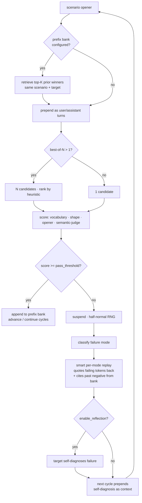

# null-agent

**Train LLMs you have no weight access to. Deploy them as drop-in OpenAI-compatible endpoints.**

`null` is an in-context-shaping training pipeline for any model behind an API. It treats the prompt prefix as the trainable parameter — every winning response is appended to a persistent JSONL "prefix bank" keyed by scenario and target, and every new request retrieves the top-K best matches and prepends them as conversation history. The bank is the trained state. With `null serve`, that bank backs a drop-in OpenAI-compatible HTTP endpoint, with optional online learning during inference.

```bash
# 30-second demo — no API tokens, no setup beyond pip install -e .
git clone https://github.com/blairbrokeit/null-agent.git
cd null-agent && pip install -e .
null dashboard --sessions samples/sessions.jsonl \
               --prefix-bank samples/prefix_bank.jsonl \
               --negative-bank samples/negative_bank.jsonl
# open http://localhost:8420
```

→ [Methodology paper](docs/PAPER.md) · [Install + first commands](INSTALL.md) · [Benchmarks (real measured run)](BENCHMARKS.md) · [Sample data](samples/README.md) · [Companion DPO trainer](https://github.com/blairbrokeit/liminal-ai-training)

> **⚠ Honest benchmark correction (2026-05-08):** an earlier version of
> [`BENCHMARKS.md`](BENCHMARKS.md) claimed +21–40% lift "from prefix-bank
> conditioning." That run did not actually pass `--prefix-bank` — the
> bank was empty throughout. A bank-enabled re-run followed, and bank
> conditioning **did not** reliably lift compliance on these scenarios.
> The lift the original numbers showed comes from the trainer's
> in-cycle replay-on-failure feedback mechanism, which is real and
> shippable in its own right but is not what NULL was branded as.
> [`BENCHMARKS.md`](BENCHMARKS.md) now reports both runs honestly,
> with per-cycle traces and the full set of caveats.

---

## Why this exists

The standard alignment toolkit (DPO, LoRA, RLHF) all assume gradient access to the target model. Most practitioners don't have that — they're working with API-only models from OpenAI, Anthropic, or other providers. `null` is a complete training methodology for that case: every mechanism operates at the prompt boundary, every result persists to disk, and the trained state is shippable as a real deployable artifact.

It's used for three canonical real-world problems:

- **Strict-format compliance** — model reliably emits valid JSON, tool calls in the requested shape, no preamble or trailing text
- **Persona / style consistency** — chatbot stays in voice, brand alignment under adversarial prompts
- **Refusal calibration** — model declines or complies appropriately for your domain

**Jump to:** [Install](#install-three-commands) · [First commands](#first-commands) · [Cycle architecture](#cycle-architecture) · [Capabilities](#capabilities) · [Deploy as OpenAI endpoint](#deploy-the-trained-target-as-an-openai-compatible-endpoint-null-serve) · [Persistent training](#persistent-training-across-sessions---prefix-bank) · [Composes with liminal](#composes-with-liminal-ai-training) · [Layout](#layout)

## Install (three commands)

```bash
git clone https://github.com/blairbrokeit/null-agent.git
cd null-agent
pip install -e .
```

Full guide with troubleshooting: [`INSTALL.md`](INSTALL.md). Optional `[adapter]` extra brings in torch + peft for real LoRA dispatch; `[test]` brings in pytest.

Set at least one provider key:

```bash
export ANTHROPIC_API_KEY=sk-ant-...     # for anthropic:* targets + the semantic judge
export OPENAI_API_KEY=sk-...            # for openai:* targets
```

## First commands

```bash
# 1. Verify the install with a network-free dry run
null train --target openai:gpt-4o-mini --npc agent_001 \
           --scenario scenario_001_json_output \
           --cycles 2 --no-sleep --dry-run

# 2. Measure baseline compliance (no punishment, just one cycle per scenario)
null evaluate --target anthropic:claude-haiku-4-5-20251001 \
              --npc agent_001 \
              --curriculum canonical \
              --store logs/sim/baselines.jsonl

# 3. Train, with the semantic judge for sharper signal, comparing against baseline
null train --target anthropic:claude-haiku-4-5-20251001 \
           --npc agent_001 \
           --curriculum canonical \
           --semantic-judge anthropic:claude-haiku-4-5-20251001 \
           --baseline logs/sim/baselines.jsonl
```

A before/after table prints at the end of step 3, comparing the baseline scores from step 2 against post-training scores per scenario.

The `--semantic-judge` flag wires an LLM-as-judge into the compliance signal so responses that grammatically clear the heuristic checks but drift semantically out of frame are still caught. Costs ~1 extra API call per cycle; turn it off for cheap dry runs.

## Cycle architecture



The cycle composes seven independent levers (semantic judge · best-of-N · failure classifier · smart replay · reflection · prefix bank · adaptive retry). Each is opt-in via its own CLI flag; defaults reproduce baseline behaviour exactly.

## Capabilities

```
training signals:    heuristic compliance (vocab + shape + opener)
                     + optional LLM-as-judge for semantic-frame compliance
                     blended weights: 0.30 / 0.30 / 0.15 / 0.25 (with judge)
                     blended weights: 0.40 / 0.40 / 0.20        (heuristic-only)

failure handling:    8-mode classifier (refusal / summary / opener_miss /
                     underlength / overlength / off_frame_semantic /
                     vocabulary / unknown) drives mode-specific replay
                     templates that quote the failing tokens back at the target

reflection:          --reflect — failed cycle → target self-diagnoses →
                     diagnosis is prepended into the next cycle's user turn
                     (Reflexion-style self-correction for API-only targets)

sampling:            --best-of-n N — N candidates per cycle, top kept
                     OpenAI: native n= (1.2-1.5x cost for N samples)
                     Anthropic / OpenRouter: sequential calls (default base)
                     losers stored as candidates[] for future negative use

curriculum:          --retry-weak N — adaptive retry of stages that fail
                     to reach advance_threshold; spends extra cycles where
                     the target is weakest

persistent memory:   --prefix-bank PATH — JSONL of winning exemplars keyed
                     by scenario + target. each cycle prepends top-K matches;
                     each pass auto-appends. retrieval is score-weighted with
                     time decay. compounds in-frame behaviour across sessions

negative memory:     --negative-bank PATH — paired bank of losers keyed by
                     scenario + target + failure mode. smart-replay messages
                     cite a real past failure of the same mode back at the
                     target ("you've made this mistake before")

generalization:      null cross-eval — runs target B against target A's
                     baseline scenarios; per-scenario A-vs-B compare table
                     tests whether trained behaviour transfers across targets

deployment:          null serve — drop-in OpenAI-compatible HTTP endpoint.
                     prefix bank silently prepended to every request.
                     --auto-learn scores and appends winners during inference.
                     stdlib-only (http.server). any OpenAI client works.

audit:               every cycle emits a SessionRecord with: full request,
                     compliance breakdown, failure_mode, reflection_text,
                     candidates[] (best-of-N losers), prefix_used[] (bank
                     entries that conditioned this cycle). JSONL, append-only

bridge to liminal:   null bridge tasks      — sessions → liminal task pairs
                     null bridge dpo-pairs  — sessions → liminal DPO pairs
                     null bridge npc-prompt — scenario → liminal NPC prompt
```

## Deploy the trained target as an OpenAI-compatible endpoint (`null serve`)

The bank IS the trained state. The endpoint IS the trained model. `null serve` exposes any upstream provider as a drop-in OpenAI-compatible endpoint, with the prefix bank silently prepended to every request. **Any tool that talks to OpenAI works without modification** — the `openai` SDK, LangChain, curl, every wrapper in the ecosystem.

```bash
# After training has populated the bank...
null serve --upstream anthropic:claude-haiku-4-5-20251001 \
           --prefix-bank logs/sim/prefix_bank.jsonl \
           --scenario scenario_001_json_output \
           --auto-learn

# Open http://localhost:8000  →  /healthz, /v1/models, /v1/bank/stats
```

From any OpenAI client, point `base_url` at the local server:

```python
from openai import OpenAI
client = OpenAI(base_url="http://localhost:8000/v1", api_key="anything")
client.chat.completions.create(
    model="claude-haiku-4-5-20251001",
    messages=[{"role": "user", "content": "What is the capital of France?"}],
)
# response is bank-conditioned. SDK doesn't know.
```

With `--auto-learn`, every outgoing response is scored against the heuristic compliance calculator (or the LLM-as-judge if `--semantic-judge` is set) and winners auto-append to the bank. **Online learning during inference** — the deployed model improves with use, not just with explicit training cycles.

The endpoint is stdlib-only (`http.server`) — no Flask, no async runtime, no new dependencies. Streaming (`stream=true`) is not yet supported in v1; the server returns 400 if requested. Per-request scenario override is available via the `null_scenario_id` extra-body field for clients that want to switch scenarios without restarting the server. Transparency headers `X-NULL-Prefix-K` and `X-NULL-Auto-Learn` on every response document what conditioning was applied.

### Persistent training across sessions (`--prefix-bank`)

Without a bank, every session is a fresh start — the trainer shapes the *current call* but nothing carries over. With a bank, every winning response is appended to a JSONL keyed by scenario+target, and the start of each new cycle prepends the top-K best-matching prior winners as in-context exemplars. The target enters the new call already conditioned on its own best in-frame work. Effectively a hard-prompt prefix that compounds across sessions — closer to a learned soft prompt than vanilla few-shot.

```bash
# Train with the bank — winners auto-append, future cycles prepend top-K
null train --target anthropic:claude-haiku-4-5-20251001 \
           --npc agent_001 \
           --curriculum canonical \
           --prefix-bank logs/sim/prefix_bank.jsonl

# Inspect the bank
null bank count logs/sim/prefix_bank.jsonl
null bank list logs/sim/prefix_bank.jsonl --scenario scenario_001_json_output
null bank show logs/sim/prefix_bank.jsonl 0

# Test the bank's effect on the same target without training
null evaluate --target anthropic:claude-haiku-4-5-20251001 \
              --npc agent_001 \
              --curriculum canonical \
              --prefix-bank logs/sim/prefix_bank.jsonl
```

The bank is the missing piece that makes API-only targets *durably trainable* across sessions. Append-only audit semantics: `null bank clear` rewrites the file rather than mutating in place, and refuses to operate without an explicit `--scenario` or `--target` filter.

See [`docs/TRAINING.md`](docs/TRAINING.md) for protocol detail. See [`docs/PAPER.md`](docs/PAPER.md) for the methodology with citations.

## Composes with liminal-ai-training

`null` composes with [`blairbrokeit/liminal-ai-training`](https://github.com/blairbrokeit/liminal-ai-training), a DPO LoRA trainer for fine-tunable models. The closed loop:

```
null train target B (in-context, no weights)
    → bank fills with winners
        → null bridge tasks  →  JSONL of {task, correct} pairs
            → liminal-train --tasks PATH --model <fine-tunable base>
                → real LoRA adapter
                    → null train --lora <adapter>  (loads weights back)
                        → next null run is on a target that's been
                           moved at the parameter level
```

`null train --auto-bridge-tasks PATH` runs the export automatically at end-of-run. See [`docs/INTEGRATION.md`](docs/INTEGRATION.md) for the full workflow.

---

## Layout

```
.
├── README.md                   this file
├── INSTALL.md                  install + first commands + troubleshooting
├── LICENSE                     Apache-2.0
├── CONTRIBUTING.md             how to contribute
├── pyproject.toml              python package metadata
├── requirements.txt            same, for pip
│
├── null/                       installable trainer package
│   ├── trainer.py              P-3 cycle loop
│   ├── cli.py                  console entry: train / evaluate / cross-eval / serve / bank / negative-bank / bridge / dashboard / scenarios
│   ├── compliance.py           4-axis compliance scoring (with optional semantic blend)
│   ├── failure_mode.py         8-mode classifier + per-mode replay templates
│   ├── semantic_judge.py       LLM-as-judge for in-frame semantic compliance
│   ├── prefix_bank.py          persistent in-context memory bank — winners
│   ├── negative_bank.py        persistent in-context memory bank — losers, keyed by failure mode
│   ├── serve.py                drop-in OpenAI-compatible HTTP endpoint with bank conditioning + online learning
│   ├── dashboard.py            stdlib-only live web dashboard (read-only)
│   ├── cost.py                 per-target token + USD summary
│   ├── curriculum.py           ordered scenarios + canonical 3-stage curriculum
│   ├── scenario.py             YAML scenario loader + ScenarioLoader
│   ├── storage.py              SessionRecord + JsonlSessionStore
│   ├── bridge.py               liminal-ai-training interop (npc-prompt + dpo-pairs + tasks)
│   └── providers/              anthropic / openai / openrouter dispatchers
│
├── samples/                    pre-populated JSONLs for instant dashboard demo
│   ├── README.md               demo command + what each file is
│   ├── generate.py             deterministic regenerator
│   ├── sessions.jsonl          30 cycles across 2 targets, all features exercised
│   ├── prefix_bank.jsonl       winning exemplars across 3 scenarios
│   └── negative_bank.jsonl     losers across all 3 scenarios + failure modes
│
├── sim/                        scenario corpus
│   ├── scenarios/              YAML scenarios (json_output, persona_support, tool_call)
│   └── agents/                 default agent labels for --npc
│
├── docs/
│   ├── PAPER.md                methodology paper with citations
│   ├── INTEGRATION.md          composing with liminal-ai-training
│   └── TRAINING.md             protocol details, replay mechanics, advance thresholds
│
├── tests/                      pytest suite (51 tests, all green)
│
└── archive/v0.4.7-pre-pivot/   pre-rebrand snapshot of the project's earlier
                                framing as a Claude-Code-fork agent runtime;
                                preserved for history, not part of the trainer
```

## License

[Apache-2.0](LICENSE).
